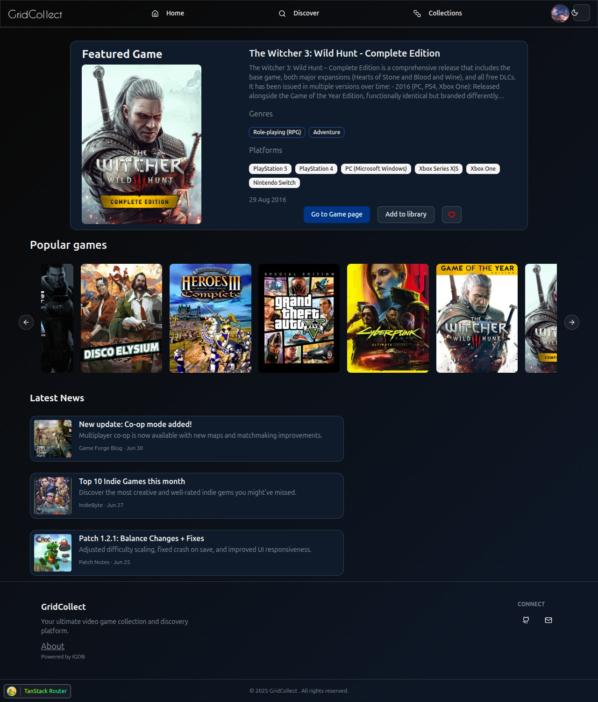
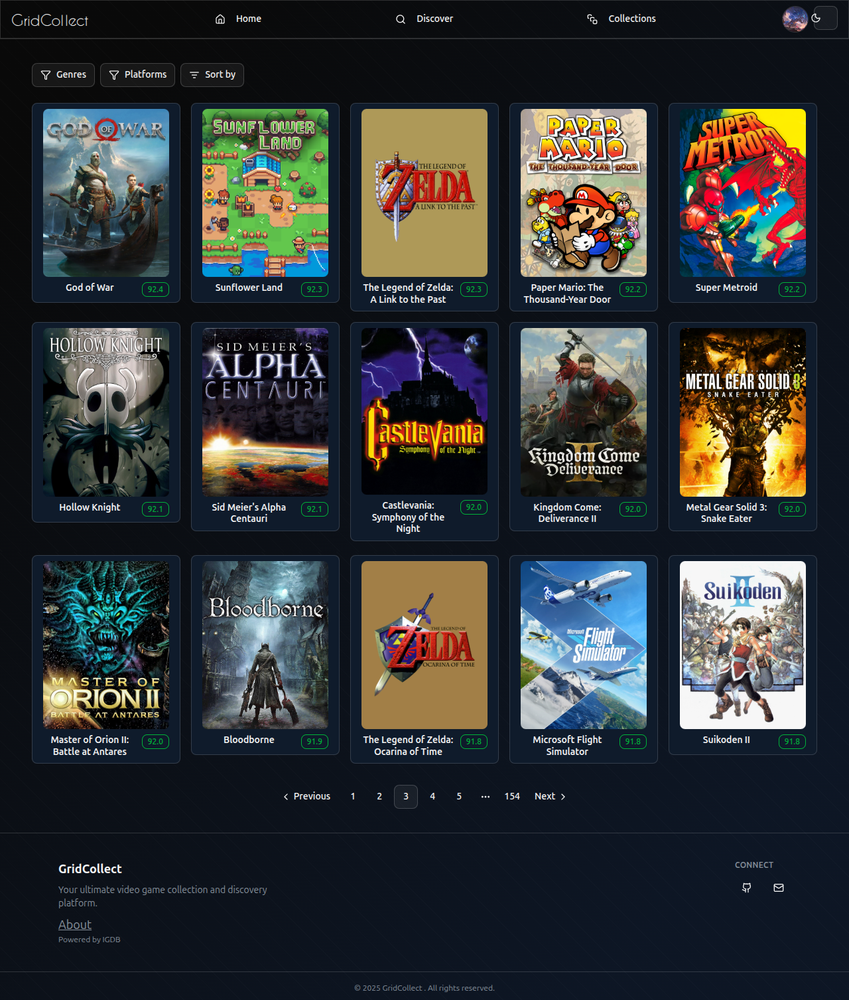
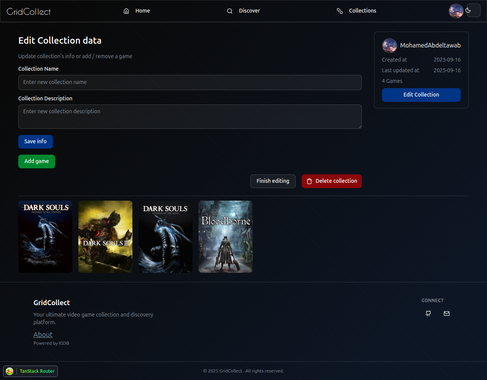
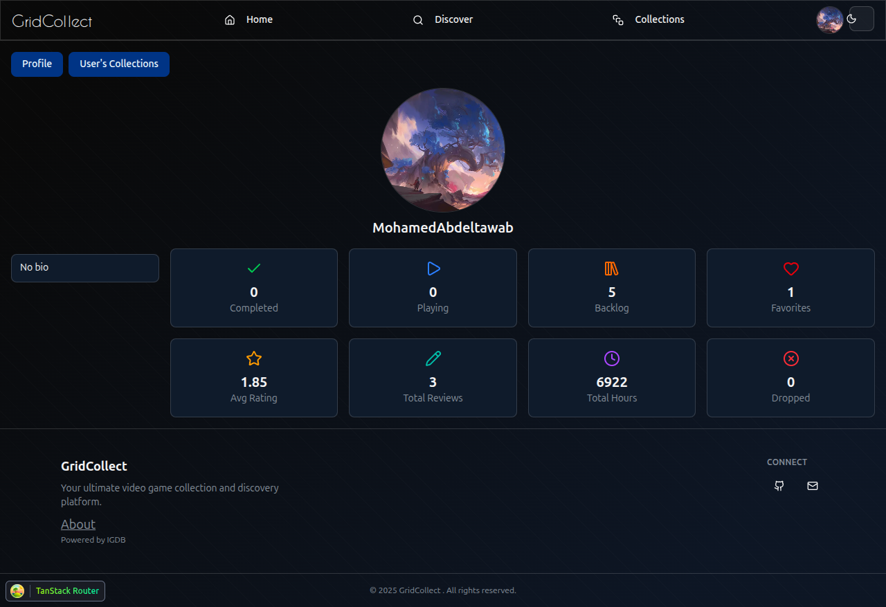

# GridCollect

## Table of Contents
- [About](#about)
- [Tech stack](#tech-stack)
- [Screenshots](#screenshots)
- [Setup instructions](#setup-instructions)
- [Deployment Instructions](#deployment-instructions)
- [Testing](#testing)

## About

GridCollect is a game collection website where you can:

- Browse and discover games
- Build your personal game library
- Create and share game collections with others
- Rate and organize games

This project is a personal practice to improve full-stack web development and manage a monorepo.

## Tech stack

- **Frontend** : React, TailwindCSS, Shadcn, Tanstack Router & Query
- **Backend** : Node.js, Express, PostgreSQL + PrismaORM
- **Other** : IGDB API for fetching games

## Screenshots

  
  
  
  

## Setup instructions

TODO

## Deployment Instructions

TODO

## Testing

TODO
